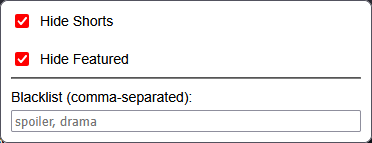

# YouTube Subscription Feed Cleaner Extension

This is Firefox extension that allows users to hide Shorts, featured sections and filter videos by keywords in their YouTube subscription feed.

## Motivation
I always use YouTube from my subscription feed, but recently it has become cluttered with Shorts and the new Featured section. Since I don't watch Shorts, I don't need them taking up space in my feed. In addition, the Featured section often contains videos that I deliberately avoided and disrupts the chronological order of the feed. Lastly, I want to be able to filter out videos with certain keywords in the title that I know I won’t be interested in.

New: With the move of the Wan Show to the ex LMG Clips channel, my feed is flooded with clips of shows I've already watched. I want to only get the full episodes of the Wan Show, not the clips. Hence, the whitelist by channel feature.

## Features
- Toggle visibility of Shorts and featured sections in the subscription feed.
- Add keywords to a blacklist to hide videos containing those keywords in the title.
- Add channels to a whitelist by channel to only show certain videos from those channels.
  

## Tech Stack
- JavaScript
- Firefox WebExtension APIs
- HTML/CSS

## Installation
[Get it from the Firefox Add-on Store](https://addons.mozilla.org/es-AR/firefox/addon/yt-subscription-feed-cleaner/)

Or load temporarily via about:debugging
